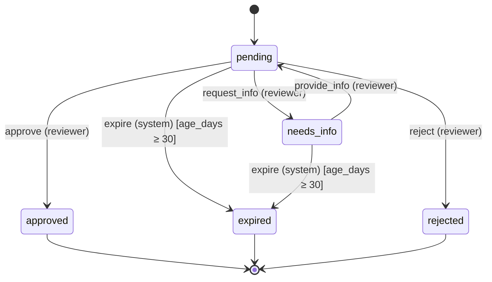

# Submission moderation lifecycle

> **Generated file — do not edit by hand.** Regenerate with `make spec-doc`. The source of truth is the spec in `app/statespec/submission_spec.py`; this document is rendered from it so the picture can never drift from the enforced behaviour.

## Lifecycle

## States

| State | Meaning |
| --- | --- |
| `pending` _(start)_ | Submitted and awaiting moderation. |
| `needs_info` | Returned to the submitter for more information. |
| `approved` _(final)_ | Accepted and published. |
| `rejected` _(final)_ | Declined by a moderator. |
| `expired` _(final)_ | Auto-closed after going stale with no decision. |

## Transitions

| Action | From | To | Who may do it | Condition |
| --- | --- | --- | --- | --- |
| **request_info** — Ask the submitter for more information. | pending | needs_info | reviewer | — |
| **provide_info** — Record that the requested information arrived; back to the queue. | needs_info | pending | reviewer | — |
| **approve** — Approve and publish the submission to the public site. | pending | approved | reviewer | — |
| **reject** — Decline the submission (final). | pending | rejected | reviewer | — |
| **expire** — Auto-close a stale submission (scheduled job, not a person). | pending, needs_info | expired | system | age_days ≥ 30 |

## Invariants

Properties that must hold in every reachable state. The engine evaluates them against the proposed post-state on every transition and refuses the transition if any fails; the property-based suite (Hypothesis) also checks them across random action sequences. (A mutation made entirely outside a transition is still beyond the engine's reach — that is the database-constraint domain.)

- **status_declared** (`status ∈ {"pending", "needs_info", "approved", "rejected", "expired"}`) — The status is always one of the declared states.
